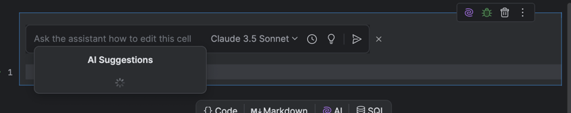
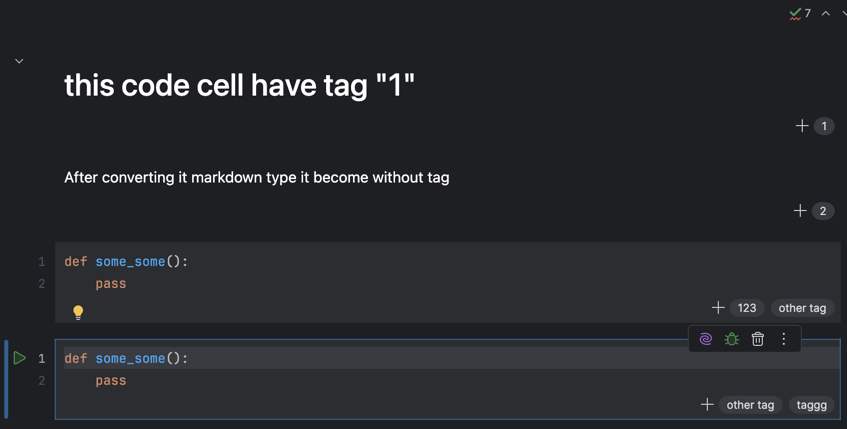
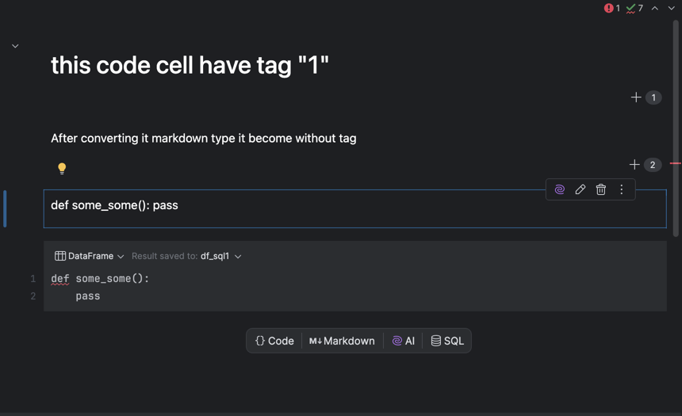
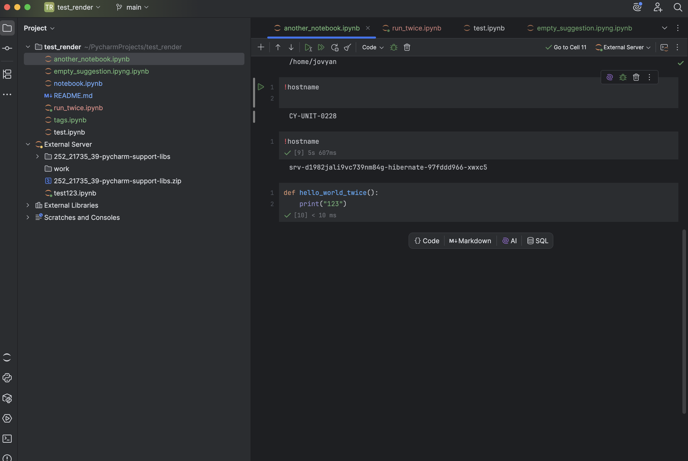
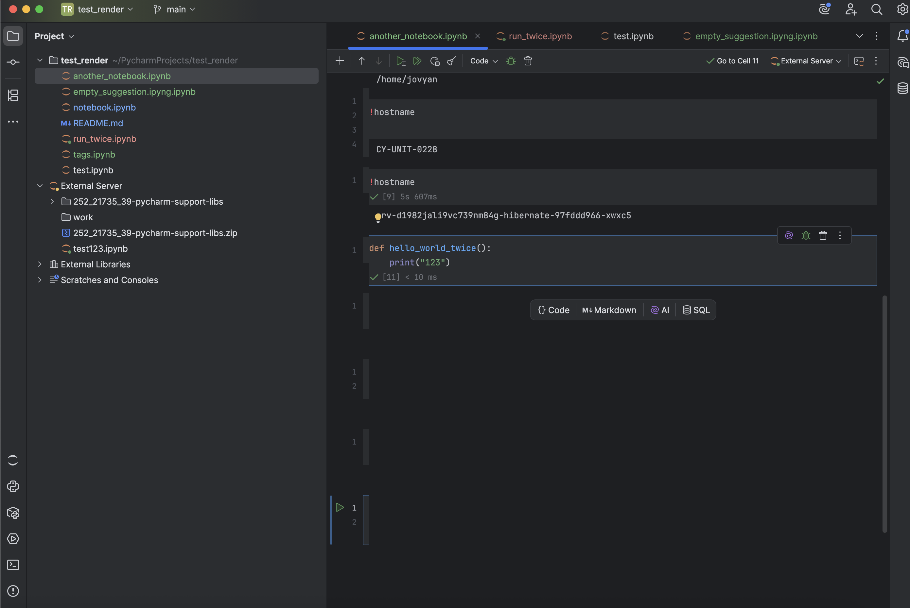

Tested connecting notebook and executing code cells via a remote server (using Render.com). After editing something on server, changes apply in pycharm also.

Tested AI generating cells, which seems to work fine.

Tested AI suggestions which work fine, except when there is nothing in the cell, they just stuck and don't say anything, but this doesn't seem like a bug.

In tags.ipyng tested tags features. After converting a code cell with a tag to another type, the tag disappears.

Tested merging, splitting cells, seems fine.

Strange visual bug, after executing a code cell:

